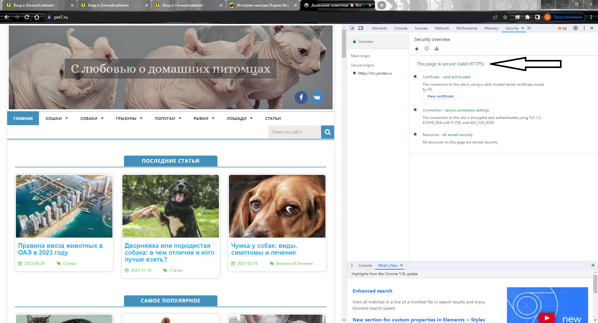
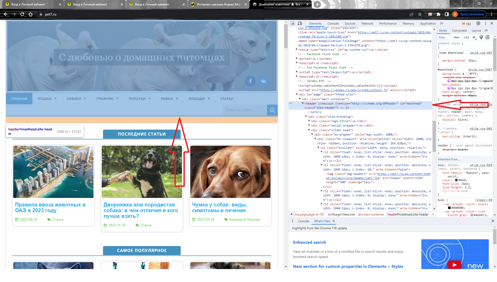
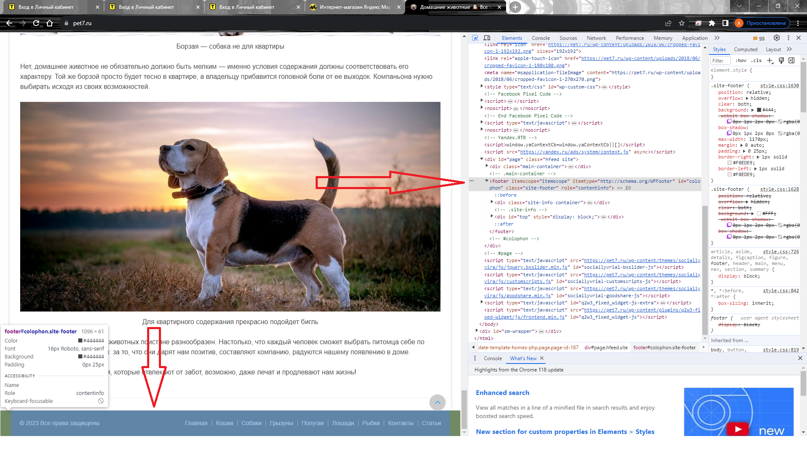
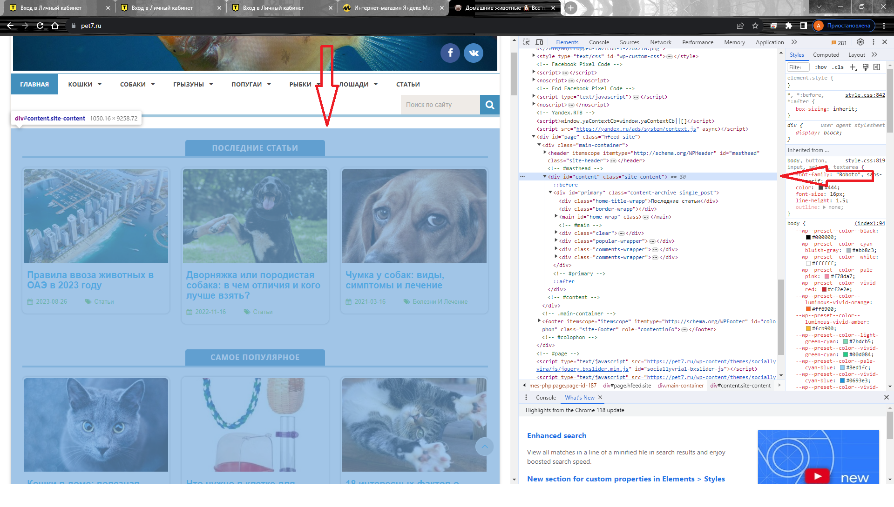
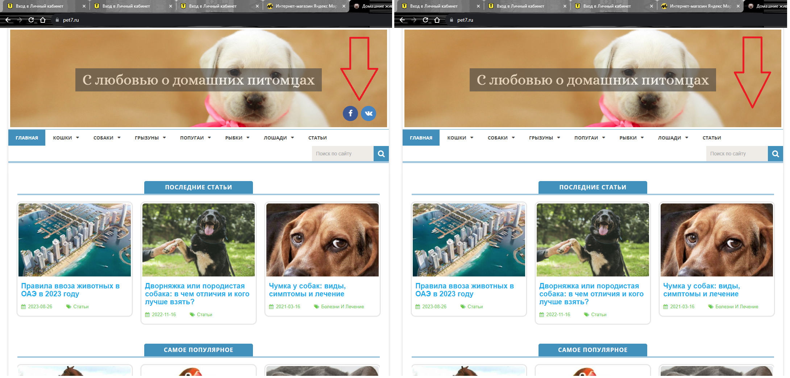
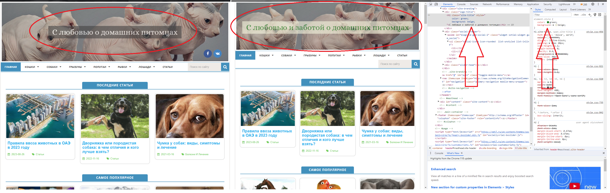
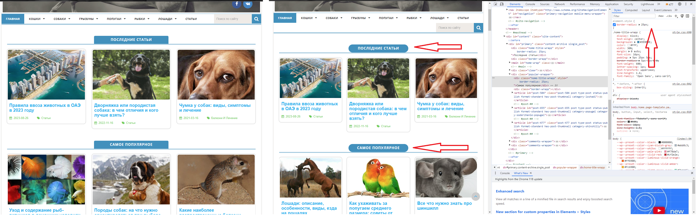
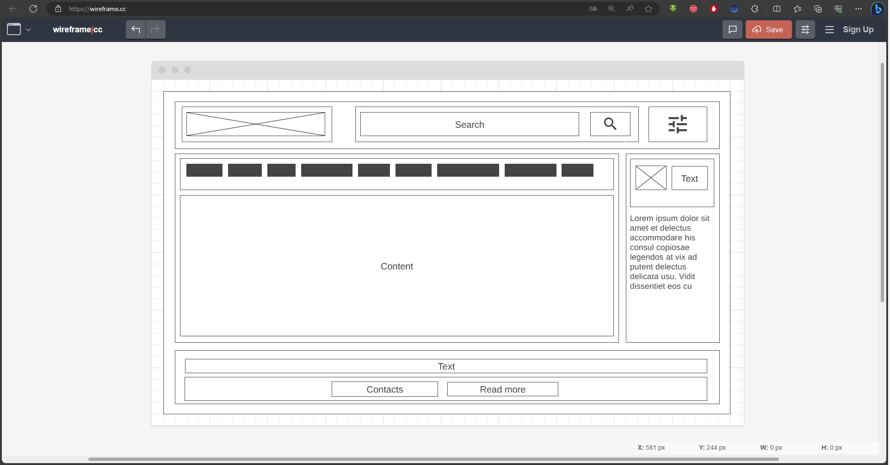

# Задача: на основе сайта https://pet7.ru/

## Определите, на каком протоколе работает сайт.

 Сайт работает по защищенному протоколу HTTPS (HyperText Transfer Protocol Security).

## Проанализируйте структуру страницы сайта. Покажите в коде где хедер, футер и контент.

 Расположение хедера на странице и HTML файле.

 Расположение футера на странице и HTML файле.

 Расположение контента на странице и HTML файле.

## Внесите не менее 3 изменений на страницу с помощью инструмента разработчика и представьте скриншоты было/стало.

Изменение 1: 
 Удалены ссылки на социальные сети.

Изменение 2: 
 Изменен текст, цвет шрифта и заднего фона.

Изменение 3: 
 Изменена форма элемента (кнопки).

## Создайте прототип низкой детализации.

Представляю свой прототип сайта:
 Прототип сайта низкой детализации.
